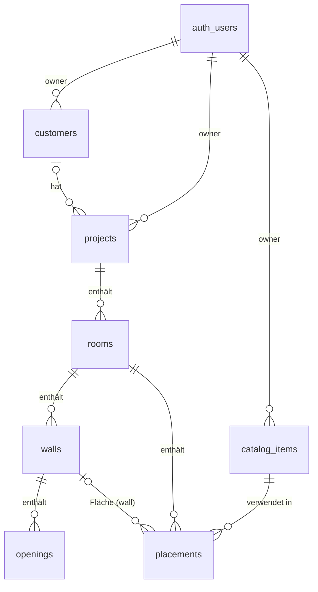

# Vsoft – Datenmodell

Definiert in [`src/lib/db/schema.ts`](../src/lib/db/schema.ts) (Drizzle ORM,
Postgres/Supabase). Initiale Migration: [`drizzle/0000_init_datenmodell.sql`](../drizzle/0000_init_datenmodell.sql).

## Konventionen

- **Längen/Koordinaten:** Millimeter als `integer` (Suffix `_mm`). Keine
  Fließkomma-Rundungsfehler beim Aufmaß; 1 mm Auflösung reicht fachlich.
- **Preise:** Euro-Cent als `integer` (`price_cents`), Preiseinheit separat
  (`per_sqm` | `per_piece`).
- **Koordinatensystem 2D:** x nach rechts, y nach unten (Screen-Koordinaten
  des 2D-Editors), Ursprung frei pro Raum. Die 3D-Ansicht mappt später
  x→x, y→z, Höhe→y.
- **IDs:** `uuid` mit `gen_random_uuid()`.
- **JSONB-Spalten** werden in [`src/lib/validation.ts`](../src/lib/validation.ts)
  per Zod validiert und typisiert.

## Entitäten

### customers – Kunden des Betriebs

| Spalte | Typ | Bemerkung |
| --- | --- | --- |
| `id` | uuid PK | |
| `owner_id` | uuid FK → `auth.users` | Betriebs-/Benutzerkonto (RLS) |
| `name` | text | Pflicht |
| `email`, `phone`, `address`, `notes` | text | optional |

### projects – Planungsprojekte

| Spalte | Typ | Bemerkung |
| --- | --- | --- |
| `owner_id` | uuid FK → `auth.users` | |
| `customer_id` | uuid FK → `customers` | optional, `on delete set null` |
| `name`, `description` | text | |
| `status` | enum `project_status` | `draft` → `active` → `completed` / `archived` |

### rooms – Räume eines Projekts

| Spalte | Typ | Bemerkung |
| --- | --- | --- |
| `project_id` | uuid FK → `projects` | `on delete cascade` |
| `name` | text | z. B. „Bad OG“ |
| `ceiling_height_mm` | integer, Default 2500 | Standard-Raumhöhe |
| `floor_material`, `ceiling_material`, `wall_material` | jsonb `MaterialConfig` | Fallback-Optik (Farbe/Textur) für Flächen **ohne** Fliesen-Placement |

### walls – Wände als gerichtete Strecken

| Spalte | Typ | Bemerkung |
| --- | --- | --- |
| `room_id` | uuid FK → `rooms` | cascade |
| `order_index` | integer | Reihenfolge im Raumpolygon |
| `start_x_mm`, `start_y_mm`, `end_x_mm`, `end_y_mm` | integer | Grundriss-Koordinaten (ersetzt `start_point`/`end_point` aus der Spec) |
| `height_mm` | integer, nullable | `null` = Raumhöhe gilt |
| `thickness_mm` | integer, Default 115 | für Darstellung & Trennwände |
| `material` | jsonb `MaterialConfig` | optischer Override pro Wand |

Der Raumumriss ist eine geordnete Kette von Wänden (`order_index`); das
Schema erzwingt Geschlossenheit bewusst **nicht** (offene Wandzüge und
Trennwände bleiben möglich) – Geometrie-Validierung passiert in der
Anwendungsschicht.

### openings – Türen, Fenster, Nischen

| Spalte | Typ | Bemerkung |
| --- | --- | --- |
| `wall_id` | uuid FK → `walls` | cascade |
| `type` | enum `opening_type` | `door` \| `window` \| `niche` |
| `offset_mm` | integer ≥ 0 | Abstand Wand-Startpunkt → linke Öffnungskante (ersetzt `position` aus der Spec) |
| `width_mm`, `height_mm` | integer > 0 | |
| `bottom_mm` | integer ≥ 0, Default 0 | Unterkante über Boden (Fenster-Brüstung, Nischen) |

### catalog_items – Fliesen & Sanitärobjekte

| Spalte | Typ | Bemerkung |
| --- | --- | --- |
| `owner_id` | uuid FK → `auth.users` | Katalog ist je Betrieb privat |
| `type` | enum `catalog_item_type` | `tile` \| `sanitary` |
| `name`, `manufacturer`, `series`, `sku`, `color_name` | text | |
| `dimensions` | jsonb, Pflicht | Fliese: `{widthMm, lengthMm, thicknessMm?, shape}`; Sanitär: `{widthMm, depthMm, heightMm}` |
| `texture_url` | text | kachelbare Textur (Supabase Storage) |
| `thumbnail_url` | text | Vorschaubild für Listen |
| `model_url` | text | 3D-Modell glTF/GLB (Sanitär) |
| `price_cents` | integer ≥ 0, nullable | netto; `null` = offen |
| `price_unit` | enum `price_unit` | `per_sqm` (Fliesen) \| `per_piece` (Sanitär) |
| `is_active` | boolean, Default true | statt Löschen deaktivieren (Placements referenzieren Items mit `on delete restrict`) |

`shape` unterstützt bereits `rectangle` | `hexagon` | `custom` für
unregelmäßige Formate.

### placements – Katalog-Items im Raum

| Spalte | Typ | Bemerkung |
| --- | --- | --- |
| `room_id` | uuid FK → `rooms` | cascade |
| `catalog_item_id` | uuid FK → `catalog_items` | `on delete restrict` |
| `surface` | enum `surface_type` | `floor` \| `ceiling` \| `wall` |
| `wall_id` | uuid FK → `walls`, nullable | Pflicht genau dann, wenn `surface = 'wall'` (DB-Check) |
| `pattern` | enum `tile_pattern`, nullable | `grid` (gerade) \| `running_bond` (versetzt) \| `herringbone` (Fischgrät); `null` bei Sanitär |
| `pattern_offset_fraction` | real | Versatz bei `running_bond` (0.5 = Halbverband, 0.33 = Drittelverband) |
| `grout_width_mm` | real ≥ 0 | Fugenbreite |
| `grout_color` | text | Hex-Farbe |
| `position` | jsonb `PositionMm` | Fliesen: Muster-Ursprung auf der Fläche (x/y); Sanitär: Position im Raum (x/y) + Höhe (z) |
| `rotation_deg` | real, Default 0 | Muster- bzw. Objekt-Rotation |

Mehrere Placements pro Fläche sind zulässig (Bordüren, Akzentstreifen,
Teilflächen); die Anwendungsschicht bestimmt Zeichnungs-/Prioritätsreihenfolge
(aktuell: `created_at`).

## Abweichungen von der Spec (bewusste Entscheidungen)

| Spec | Umsetzung | Grund |
| --- | --- | --- |
| `Wall.start_point/end_point` | 4 Integer-Spalten `*_mm` | einfach indizier-/validierbar, kein JSON-Parsing im Editor-Hot-Path |
| `Opening.position` | `offset_mm` entlang der Wand | eindeutige 1D-Position auf der Trägerwand |
| `CatalogItem.price` | `price_cents` + `price_unit` | ganzzahlig rechnen, m²- vs. Stückpreis abbildbar |
| `Room.wall_materials` | `rooms.wall_material` (Default) + `walls.material` (Override) | pro Wand abweichende Optik ohne Extra-Tabelle |
| – | Zusatztabelle `customers` | Spec referenziert `customer_id`; Kundenverwaltung gehört zum Angebotsflow |

## Sicherheit (RLS)

- Alle Tabellen haben **Row Level Security aktiv**; Policies erlauben dem
  Besitzer (`owner_id = auth.uid()`, bei Kind-Tabellen über den Join-Pfad
  zum Projekt) sämtliche Operationen, allen anderen nichts.
- Gilt für Zugriffe über die Supabase-API (`supabase-js`/PostgREST, anon
  key). Der serverseitige Drizzle-Client verbindet sich als Tabellen-Owner
  und **umgeht RLS** – Server-Code muss Autorisierung selbst prüfen
  (Projekt-Ownership laden, bevor geschrieben wird).
- Später geplant: Read-only-Sharing per Token (eigene Policy oder
  signierte Server-Route) für den Kunden-Link.

## Offene Punkte für spätere Schritte

- Türanschlag/Öffnungsrichtung an `openings` (Rendering-Detail für 3D).
- Verschnitt-Faktor (z. B. +10 %) und Angebots-Positionen → eigenes
  Angebotsmodul (Schritt 7).
- Mehrbenutzer-Betriebe (Organisationen statt Einzel-Owner) → separate
  `organizations`-Tabelle, wenn Resale konkret wird.
